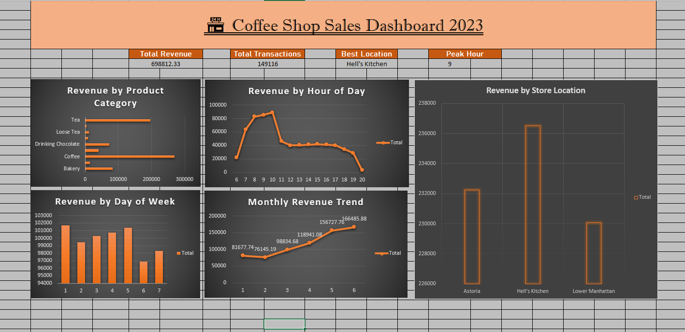

# ☕ Coffee Shop Sales Dashboard 2023
### Excel Dashboard | 1,49,116 Transactions | Business Intelligence

---

## 📌 Project Overview
Analyzed 1,49,116 coffee shop transactions across 3 New York 
locations to uncover revenue patterns, peak hours, and 
best performing products using Excel Dashboard.

---

## 🛠️ Tools Used
- **Microsoft Excel** — Pivot Tables, Charts, Dashboard

---

## 📂 Dataset
- **Source:** Kaggle Coffee Shop Sales Dataset
- **Transactions:** 1,49,116 records
- **Period:** January 2023 — June 2023

---

## 🔑 Key Business Findings

| # | Finding | Insight |
|---|---|---|
| 1 | Total Revenue | ☕ $698,812 in 6 months! |
| 2 | Best Location | 📍 Hell's Kitchen leads! |
| 3 | Peak Hour | ⏰ 9-10 AM busiest time! |
| 4 | Best Category | ☕ Coffee dominates revenue! |
| 5 | Best Day | 📅 Monday highest sales! |
| 6 | Monthly Trend | 📈 Revenue growing every month! |

---

## 📊 Dashboard Preview

---

## 💡 Business Recommendations

1. **Staff more at 9-10 AM** — Peak hours need more 
   baristas to handle rush!

2. **Focus on Hell's Kitchen** — Highest revenue location.
   Replicate its strategy in other stores!

3. **Monday promotions** — Already highest sales day.
   Loyalty rewards on Monday can increase retention!

4. **Boost weekend sales** — Saturday is lowest.
   Special weekend offers can help!

5. **Coffee is king** — 40%+ revenue from Coffee category.
   Expand coffee menu with seasonal specials!

---

## 📁 Project Structure
---

## 🙋 About Me
Aspiring Data Analyst passionate about turning raw data
into business insights using Excel, SQL and Python.

📧 Connect with me on LinkedIn: [https://www.linkedin.com/in/rahulsharma-analyst]
